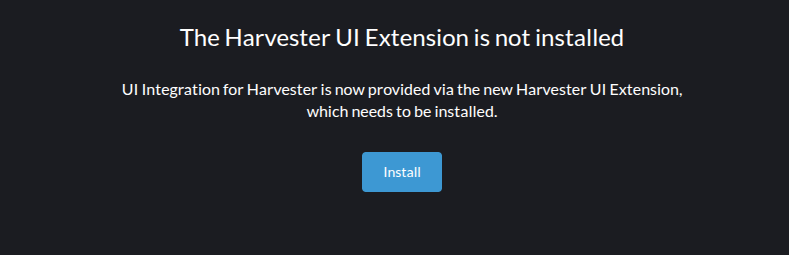

# Air-gapped Environment

In order to load the harvester extension within an air-gapped instance of Rancher, you will need to import an Extension Catalog Image to provide the extension assets, which are then served within the "Available" tab of the Extensions page and can be installed as normal.

The Extension Catalog Image (ECI) contains the assets which gives the ui-plugin-operator the necessary files to load Harvester UI into the Rancher Dashboard.

## Prerequisites

Loading the extension into an air-gapped envrionment requires a few prerequisites, namely:

- The Extension needs to be bundled into the ECI
- A registry to house the ECI
- Access to this registry within the air-gapped Cluster

### Building the Extension Catalog Image

Follow this [guide](https://extensions.rancher.io/extensions/next/advanced/air-gapped-environments#building-the-extension-catalog-image) to create the ECI.

- For Prime users, the ECI is already provided by Rancher: https://hub.docker.com/r/rancher/ui-plugin-catalog/tags

### Importing the Extension Catalog Image

Follow this [guide](https://extensions.rancher.io/extensions/next/advanced/air-gapped-environments#importing-the-extension-catalog-image) to import your Harvester ECI in Rancher.

- Note that for air-gapped environment, Harvester can only be installed manually.
The Installation button is **not** supported at the moment.

    

### Updating the Extension Catalog Image

In order to include the new Harvester extension versions when published

- Re-build the ECI and push the new ECI image in your registry.
- Sync-up the new registry in Rancher (Manage Extension Catalogs -> Import Extension Catalog)

